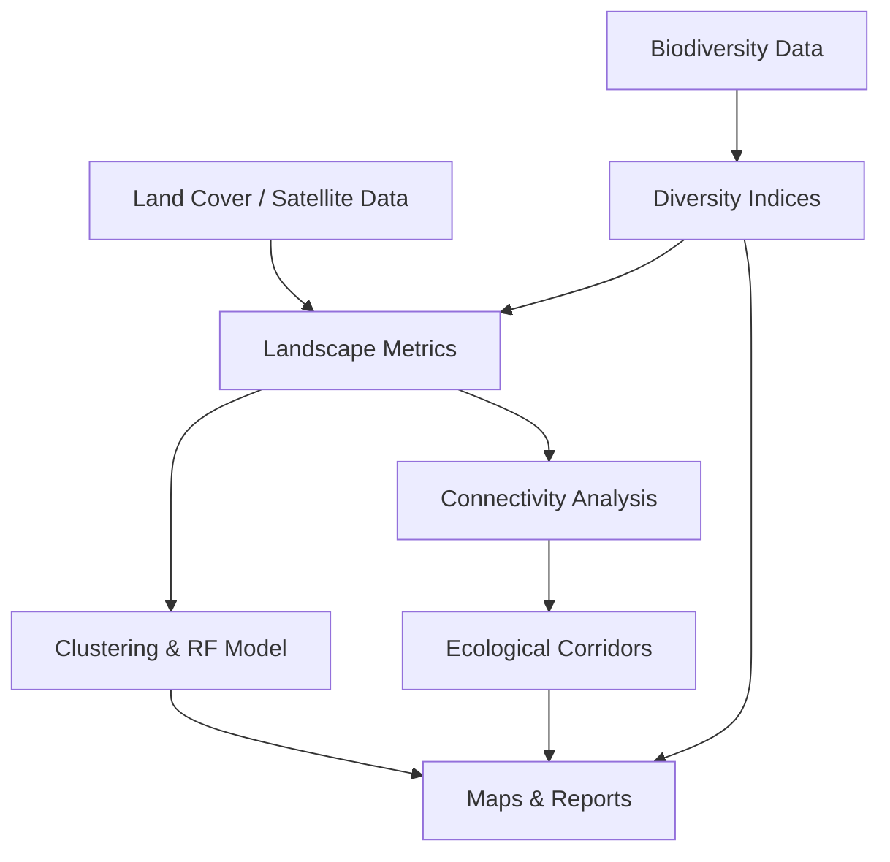

# 🌿 agrobiodivR

[]()
[]()
[]()

## Overview

**agrobiodivR** is an R package dedicated to the analysis of agricultural biodiversity and habitat connectivity. It provides a complete and reproducible workflow for biodiversity assessment, landscape analysis, habitat fragmentation measurement, ecological corridor identification, and automated reporting.

The package was developed as an academic project to demonstrate the application of ecological and spatial analysis methods using the R programming language.

### Key Features

* 🌱 Biodiversity assessment using ecological indices (Shannon, Simpson, richness)
* 🛰️ Satellite imagery download and land cover processing
* 🗺️ Agricultural landscape analysis and clustering
* 🌳 Habitat fragmentation measurement
* 🔗 Habitat connectivity assessment
* 🦋 Ecological corridor identification
* 🤖 Machine learning (Random Forest) for biodiversity prediction
* 📊 Automatic visualization and reporting
* 📂 Reproducible workflows for environmental studies

---

## Workflow



The package follows a complete ecological analysis workflow, from raw biodiversity observations and land cover data to the generation of decision-support outputs such as connectivity indicators, ecological corridors, predictive models, and automated reports.

---

## Package Structure

```text
agrobiodivR/
├── R/
│   ├── import_biodiversity_data.R
│   ├── calculate_diversity_indices.R
│   ├── import_landcover.R
│   ├── download_satellite_data.R
│   ├── calculate_landscape_metrics.R
│   ├── calculate_distance_to_habitat.R
│   ├── analyze_connectivity.R
│   ├── cluster_landscapes.R
│   ├── train_rf_model.R
│   ├── evaluate_model.R
│   ├── identify_ecological_corridors.R
│   ├── plot_biodiversity_map.R
│   ├── plot_connectivity_map.R
│   ├── generate_recommendations.R
│   └── generate_agroeco_report.R
│
├── data/
│   └── biodiversity_sample.rda
│
├── man/
├── tests/
│   └── testthat/
├── vignettes/
│   └── agrobiodivR_tutorial.Rmd
├── README.md
├── DESCRIPTION
└── NAMESPACE
```

---

## Installation

```r
# Install devtools if necessary
install.packages("devtools")

# Install agrobiodivR from GitHub
devtools::install_github("israeabm-dev/agrobiodivR")
```

---

## Main Functions

| Function                           | Description                                                                |
| ----------------------------------- | ----------------------------------------------------------------------------- |
| `import_biodiversity_data()`       | Import biodiversity observations (CSV/Excel) into a community matrix and `sf` object |
| `calculate_diversity_indices()`    | Compute Shannon, Simpson, and species richness indices per plot           |
| `import_landcover()`               | Import and reclassify land cover rasters (Corine, ESA, OSM)               |
| `download_satellite_data()`        | Download and prepare satellite imagery for the study area                 |
| `calculate_landscape_metrics()`    | Calculate patch size, fragmentation, and landscape diversity               |
| `calculate_distance_to_habitat()`  | Compute distance rasters to forests, hedgerows, and semi-natural habitats |
| `analyze_connectivity()`           | Assess functional connectivity and detect isolated patches                |
| `cluster_landscapes()`             | Classify agricultural landscapes using K-means clustering                 |
| `train_rf_model()`                 | Train a Random Forest model relating biodiversity to landscape variables |
| `evaluate_model()`                 | Evaluate model performance (RMSE, R², variable importance)                |
| `identify_ecological_corridors()`  | Identify potential ecological corridors between close habitat patches    |
| `plot_biodiversity_map()`          | Generate biodiversity index maps                                          |
| `plot_connectivity_map()`          | Generate connectivity and corridor maps                                   |
| `generate_recommendations()`       | Produce automated ecological recommendations                              |
| `generate_agroeco_report()`        | Generate an automated HTML/PDF report combining all results               |

---

## Function Reference

> **Note:** all examples below use the bundled example dataset `biodiversity_sample`, loaded with `data("biodiversity_sample")`. Replace argument values with your own data paths and parameters as needed.

### 1. Data Import

#### `import_biodiversity_data(file = NULL, data = NULL)`

Imports field biodiversity data (species, abundance, plot, GPS coordinates) from a CSV/Excel file or a data frame, handles missing values, and builds a community matrix and a spatial (`sf`) object.

* **Arguments**
  * `file` — path to a CSV or Excel file (optional)
  * `data` — a data frame with columns `espece`, `abondance`, `parcelle`, `lat`, `lon` (optional, used if `file` is `NULL`)
* **Returns**: a list with
  * `community_matrix` — plot × species abundance matrix
  * `spatial` — `sf` object with plot geometries

```r
data("biodiversity_sample")
result <- import_biodiversity_data(data = biodiversity_sample)
head(result$community_matrix)
```

---

#### `import_landcover(raster_path, source = "corine")`

Imports a land cover raster, reclassifies it into broad classes (agriculture, forest, grassland, urban), and clips it to the study area.

* **Arguments**
  * `raster_path` — path to the land cover raster file
  * `source` — data source: `"corine"`, `"esa"`, or `"osm"`
* **Returns**: a reclassified land cover raster

```r
landcover <- import_landcover("data/landcover.tif", source = "corine")
```

---

#### `download_satellite_data(bbox, date_range, source = "sentinel2")`

Downloads satellite imagery for the study area over a given period and prepares it for landscape analysis (new feature added to this package).

* **Arguments**
  * `bbox` — bounding box of the study area (e.g. `c(xmin, ymin, xmax, ymax)`)
  * `date_range` — vector of two dates, e.g. `c("2024-01-01", "2024-06-01")`
  * `source` — imagery provider (default `"sentinel2"`)
* **Returns**: a raster stack of satellite bands

```r
satellite <- download_satellite_data(
  bbox = c(-6.90, 33.95, -6.80, 34.05),
  date_range = c("2024-01-01", "2024-06-01")
)
```

---

### 2. Biodiversity Indices

#### `calculate_diversity_indices(comm_matrix)`

Computes Shannon, Simpson, and species richness indices for each plot.

* **Arguments**
  * `comm_matrix` — community matrix returned by `import_biodiversity_data()`
* **Returns**: a data frame with columns `parcelle`, `shannon`, `simpson`, `richness`

```r
indices <- calculate_diversity_indices(result$community_matrix)
print(indices)
```

---

### 3. Landscape Analysis

#### `calculate_landscape_metrics(indices)`

Calculates simple landscape-level statistics (mean/SD of diversity, fragmentation index) from plot-level diversity indices.

* **Arguments**
  * `indices` — data frame returned by `calculate_diversity_indices()`
* **Returns**: a data frame with columns `mean_shannon`, `sd_shannon`, `mean_richness`, `fragmentation`

```r
metrics <- calculate_landscape_metrics(indices)
print(metrics)
```

---

#### `calculate_distance_to_habitat(landcover, target_classes = c("forest", "hedgerow"))`

Computes a distance raster from each cell to the nearest target habitat class, and extracts distance values per plot.

* **Arguments**
  * `landcover` — land cover raster (output of `import_landcover()`)
  * `target_classes` — character vector of habitat classes to measure distance to
* **Returns**: a list with
  * `distance_raster` — raster of distances to nearest target habitat
  * `connectivity_variables` — data frame of extracted distance values per plot

```r
dist_result <- calculate_distance_to_habitat(landcover, target_classes = "forest")
```

---

#### `cluster_landscapes(metrics, k = 3)`

Classifies agricultural landscapes into groups using K-means clustering based on fragmentation, land cover diversity, and connectivity.

* **Arguments**
  * `metrics` — data frame of landscape metrics (output of `calculate_landscape_metrics()`)
  * `k` — number of clusters (default 3)
* **Returns**: a data frame with an added `cluster` column

```r
clusters <- cluster_landscapes(metrics, k = 3)
print(clusters)
```

---

### 4. Connectivity

#### `analyze_connectivity(spatial_obj, max_distance = 500)`

Performs a simple connectivity analysis: computes distances between patches, derives a functional connectivity index, and flags isolated patches.

* **Arguments**
  * `spatial_obj` — `sf` object with plot/patch geometries (e.g. `result$spatial`)
  * `max_distance` — distance threshold (in meters, depending on CRS) used to define connected patches
* **Returns**: a data frame with columns `parcelle`, `connectivity`, `isolated` (logical)

```r
connectivity <- analyze_connectivity(result$spatial, max_distance = 1000)
print(connectivity)
```

---

#### `identify_ecological_corridors(patches, max_distance = 500)`

Identifies potential ecological corridors by connecting habitat patches whose distance is below a given threshold.

* **Arguments**
  * `patches` — `sf` object with patch geometries
  * `max_distance` — maximum distance (in meters) to consider a corridor between two patches
* **Returns**: an `sf` object of `LINESTRING` geometries representing potential corridors

```r
corridors <- identify_ecological_corridors(result$spatial, max_distance = 5000)
```

---

### 5. Modeling

#### `train_rf_model(data, target = "shannon", predictors = c("fragmentation", "distance_habitat"))`

Trains a Random Forest model exploring the relationship between agricultural practices/landscape variables and a biodiversity index.

* **Arguments**
  * `data` — data frame combining biodiversity indices and landscape/connectivity variables
  * `target` — name of the response variable (default `"shannon"`)
  * `predictors` — character vector of explanatory variable names
* **Returns**: a list with
  * `model` — trained `randomForest` object
  * `importance` — variable importance table

```r
rf_result <- train_rf_model(
  data = merged_data,
  target = "shannon",
  predictors = c("fragmentation", "distance_habitat")
)
```

---

#### `evaluate_model(model, test_data)`

Evaluates the performance of a trained model using RMSE and R², and produces an observed-vs-predicted plot and a variable importance plot.

* **Arguments**
  * `model` — model object returned by `train_rf_model()` (use `rf_result$model`)
  * `test_data` — validation data frame with the same predictor and target columns
* **Returns**: a list with
  * `performance` — data frame with `rmse`, `r2`
  * `plots` — list of diagnostic ggplot2 plots

```r
performance <- evaluate_model(rf_result$model, test_data)
print(performance$performance)
```

---

### 6. Visualization

#### `plot_biodiversity_map(spatial_obj, indices, index = "shannon")`

Generates a map showing a biodiversity index (Shannon, Simpson, or richness) per plot.

* **Arguments**
  * `spatial_obj` — `sf` object with plot geometries
  * `indices` — data frame returned by `calculate_diversity_indices()`
  * `index` — name of the index column to map (default `"shannon"`)
* **Returns**: a `ggplot2` map object

```r
plot_biodiversity_map(result$spatial, indices, index = "shannon")
```

---

#### `plot_connectivity_map(spatial_obj, connectivity_index, corridors = NULL)`

Generates a map of habitat connectivity, with an optional overlay of ecological corridors.

* **Arguments**
  * `spatial_obj` — `sf` object with plot/patch geometries
  * `connectivity_index` — data frame returned by `analyze_connectivity()` (must contain a `connectivity` column)
  * `corridors` — optional `sf` object of corridors returned by `identify_ecological_corridors()`
* **Returns**: a `ggplot2` map object

```r
plot_connectivity_map(result$spatial, connectivity, corridors = corridors)
```

---

### 7. Recommendations & Reporting

#### `generate_recommendations(metrics, connectivity_index = NULL)`

Produces automated, text-based ecological recommendations based on landscape metrics and, optionally, connectivity results.

* **Arguments**
  * `metrics` — data frame returned by `calculate_landscape_metrics()`
  * `connectivity_index` — optional data frame returned by `analyze_connectivity()`
* **Returns**: a character vector of recommendations

```r
recommendations <- generate_recommendations(metrics, connectivity)
print(recommendations)
```

---

#### `generate_agroeco_report(indices, metrics, connectivity, corridors, recommendations, output_format = "html")`

Generates a complete automated report (HTML or PDF) summarizing biodiversity indices, landscape metrics, connectivity, proposed corridors, and recommendations.

* **Arguments**
  * `indices` — output of `calculate_diversity_indices()`
  * `metrics` — output of `calculate_landscape_metrics()`
  * `connectivity` — output of `analyze_connectivity()`
  * `corridors` — output of `identify_ecological_corridors()`
  * `recommendations` — output of `generate_recommendations()`
  * `output_format` — `"html"` or `"pdf"` (default `"html"`)
* **Returns**: file path to the generated report

```r
report_path <- generate_agroeco_report(
  indices, metrics, connectivity, corridors, recommendations,
  output_format = "html"
)
```

---

## Example Usage (Full Workflow)

```r
library(agrobiodivR)

# 1. Import biodiversity data
data("biodiversity_sample")
result <- import_biodiversity_data(data = biodiversity_sample)

# 2. Diversity indices
indices <- calculate_diversity_indices(result$community_matrix)

# 3. Land cover & satellite data
landcover <- import_landcover("data/landcover.tif", source = "corine")
satellite <- download_satellite_data(
  bbox = c(-6.90, 33.95, -6.80, 34.05),
  date_range = c("2024-01-01", "2024-06-01")
)

# 4. Landscape metrics
metrics <- calculate_landscape_metrics(indices)

# 5. Distance to habitat
dist_result <- calculate_distance_to_habitat(landcover, target_classes = "forest")

# 6. Connectivity & corridors
connectivity <- analyze_connectivity(result$spatial, max_distance = 1000)
corridors <- identify_ecological_corridors(result$spatial, max_distance = 5000)

# 7. Landscape clustering
clusters <- cluster_landscapes(metrics, k = 3)

# 8. Modeling
rf_result <- train_rf_model(merged_data, target = "shannon",
                             predictors = c("fragmentation", "distance_habitat"))
performance <- evaluate_model(rf_result$model, test_data)

# 9. Visualization
plot_biodiversity_map(result$spatial, indices)
plot_connectivity_map(result$spatial, connectivity, corridors = corridors)

# 10. Recommendations & report
recommendations <- generate_recommendations(metrics, connectivity)
generate_agroeco_report(indices, metrics, connectivity, corridors, recommendations,
                         output_format = "html")
```

---

## Biodiversity Assessment

Biodiversity indices provide a quantitative measure of species richness and abundance distribution within agricultural ecosystems.

### Example Output

| Index            | Value |
| ----------------- | ----- |
| Shannon Index     | 1.87  |
| Simpson Index     | 0.78  |
| Species Richness  | 15    |


---

## Landscape Analysis

Landscape metrics help characterize the spatial organization of agricultural habitats and evaluate fragmentation levels.

Indicators include:

* Number of habitat patches
* Mean patch size
* Edge density
* Habitat proportion
* Landscape diversity


---

## Habitat Connectivity

Connectivity analysis evaluates how easily species can move between habitat patches across agricultural landscapes.

The package provides simplified connectivity indicators that can support:

* Biodiversity conservation
* Habitat restoration planning
* Ecological network design


---

## Ecological Corridors

One of the package's objectives is to identify potential ecological corridors connecting isolated habitats.

These corridors can contribute to:

* Species dispersal
* Gene flow maintenance
* Ecosystem resilience
* Biodiversity conservation

Example conceptual representation:

```text
Habitat A ───── Corridor ───── Habitat B
       \                         /
        \                       /
         ─── Intermediate Patch ───
```

---

## Use Case

Consider an agricultural region containing several fragmented natural habitats.

Using agrobiodivR, users can:

1. Import biodiversity observations.
2. Compute diversity indices.
3. Import land cover and satellite data.
4. Analyze landscape structure and fragmentation.
5. Measure habitat connectivity.
6. Detect ecological corridors.
7. Cluster landscapes and model biodiversity drivers.
8. Produce visualizations and reports.
9. Generate management recommendations.

This workflow supports environmental assessment and sustainable agricultural planning.

---

## Outputs

The package can generate:

* Biodiversity indicators (Shannon, Simpson, richness)
* Landscape statistics and fragmentation metrics
* Connectivity metrics and landscape clusters
* Predictive models (Random Forest) and performance metrics
* Ecological corridor identification (shapefiles)
* Maps and visualizations (biodiversity, connectivity)
* Automated recommendations
* Reproducible HTML/PDF reports

---

## Scientific Background

The package is based on widely used ecological concepts and indicators:

### Biodiversity

* Shannon Diversity Index
* Simpson Diversity Index
* Species Richness

### Landscape Ecology

* Habitat Fragmentation
* Landscape Structure Metrics
* Patch Analysis
* Landscape Clustering (K-means)

### Connectivity Ecology

* Distance-based Connectivity
* Ecological Networks
* Corridor Identification

### Predictive Modeling

* Random Forest regression
* Variable importance analysis
* Model evaluation (RMSE, R²)

These methods are commonly used in biodiversity monitoring, conservation planning, and landscape ecology studies.

---

## Testing

The package includes unit tests to ensure that core functions behave as expected.

```r
devtools::test()
```

---

## Documentation

Additional documentation is available through:

```r
?import_biodiversity_data
?calculate_diversity_indices
?import_landcover
?download_satellite_data
?calculate_landscape_metrics
?calculate_distance_to_habitat
?analyze_connectivity
?cluster_landscapes
?train_rf_model
?evaluate_model
?identify_ecological_corridors
?plot_biodiversity_map
?plot_connectivity_map
?generate_recommendations
?generate_agroeco_report
```

A complete vignette is also provided to guide users through the full package workflow:

```r
vignette("agrobiodivR_tutorial", package = "agrobiodivR")
```

---

## Future Improvements

Future versions of agrobiodivR may include:

* Advanced connectivity modelling (graph theory approaches)
* Deeper machine learning integration
* GIS interoperability
* Interactive dashboards
* Species distribution modelling
* Enhanced automated reporting

---

## Authors

Developed by:

**Israe Ait Oubrahim**

Academic project – Agricultural Biodiversity and Habitat Connectivity Analysis.

---

## License

This project is distributed under the MIT License.
