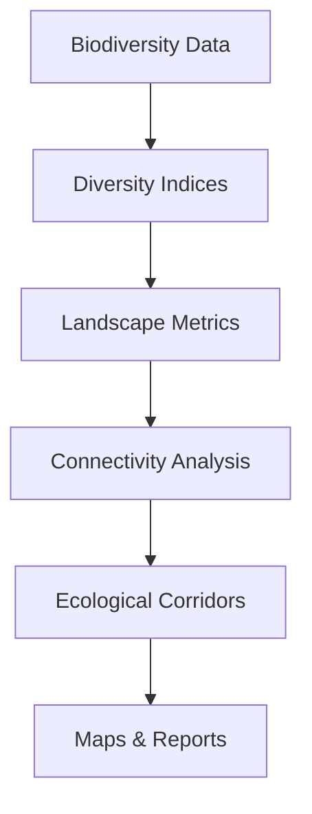

# 🌿 agrobiodivR

[]()
[]()
[]()

## Overview

**agrobiodivR** is an R package dedicated to the analysis of agricultural biodiversity and habitat connectivity. It provides a complete and reproducible workflow for biodiversity assessment, landscape analysis, habitat fragmentation measurement, ecological corridor identification, and automated reporting.

The package was developed as an academic project to demonstrate the application of ecological and spatial analysis methods using the R programming language.

### Key Features

* 🌱 Biodiversity assessment using ecological indices
* 🗺️ Agricultural landscape analysis
* 🌳 Habitat fragmentation measurement
* 🔗 Habitat connectivity assessment
* 🦋 Ecological corridor identification
* 📊 Automatic visualization and reporting
* 📂 Reproducible workflows for environmental studies

---

## Workflow



The package follows a complete ecological analysis workflow, from raw biodiversity observations to the generation of decision-support outputs such as connectivity indicators, ecological corridors, and automated reports.

---

## Package Structure

```text
agrobiodivR/
├── R/
│   ├── import_biodiversity_data.R
│   ├── calculate_diversity_indices.R
│   ├── import_landcover.R
│   ├── calculate_landscape_metrics.R
│   ├── calculate_distance_to_habitat.R
│   ├── analyze_connectivity.R
│   ├── identify_ecological_corridors.R
│   ├── plot_biodiversity_map.R
│   └── generate_recommendations.R
│
├── data/
├── man/
├── tests/
├── vignettes/
├── README.md
├── DESCRIPTION
└── NAMESPACE
```

---

## Main Functions

| Function                          | Description                                   |
| --------------------------------- | --------------------------------------------- |
| `import_biodiversity_data()`      | Import biodiversity observations              |
| `calculate_diversity_indices()`   | Compute Shannon and Simpson diversity indices |
| `import_landcover()`              | Import land cover datasets                    |
| `calculate_landscape_metrics()`   | Calculate basic landscape metrics             |
| `calculate_distance_to_habitat()` | Estimate distances between habitat patches    |
| `analyze_connectivity()`          | Assess habitat connectivity                   |
| `identify_ecological_corridors()` | Identify potential ecological corridors       |
| `plot_biodiversity_map()`         | Generate biodiversity maps                    |
| `generate_recommendations()`      | Produce ecological recommendations            |

---

## Installation

```r
# Install devtools if necessary
install.packages("devtools")

# Install agrobiodivR from GitHub
devtools::install_github("israeabm-dev/agrobiodivR")
```

---

## Example Usage

```r
library(agrobiodivR)

# Load example dataset
data("biodiversity_example")

# Calculate biodiversity indices
diversity_results <- calculate_diversity_indices(
  biodiversity_example
)

# Connectivity analysis
connectivity_results <- analyze_connectivity(
  biodiversity_example
)

# Generate recommendations
generate_recommendations(
  diversity_results,
  connectivity_results
)
```

---

## Biodiversity Assessment

Biodiversity indices provide a quantitative measure of species richness and abundance distribution within agricultural ecosystems.

### Example Output

| Index            | Value |
| ---------------- | ----- |
| Shannon Index    | 1.87  |
| Simpson Index    | 0.78  |
| Species Richness | 15    |


---

## Landscape Analysis

Landscape metrics help characterize the spatial organization of agricultural habitats and evaluate fragmentation levels.

Indicators may include:

* Number of habitat patches
* Mean patch size
* Edge density
* Habitat proportion
* Landscape diversity


---

## Habitat Connectivity

Connectivity analysis evaluates how easily species can move between habitat patches across agricultural landscapes.

The package provides simplified connectivity indicators that can support:

* Biodiversity conservation
* Habitat restoration planning
* Ecological network design


---

## Ecological Corridors

One of the package's objectives is to identify potential ecological corridors connecting isolated habitats.

These corridors can contribute to:

* Species dispersal
* Gene flow maintenance
* Ecosystem resilience
* Biodiversity conservation

Example conceptual representation:

```text
Habitat A ───── Corridor ───── Habitat B
       \                         /
        \                       /
         ─── Intermediate Patch ───
```

---

## Use Case

Consider an agricultural region containing several fragmented natural habitats.

Using agrobiodivR, users can:

1. Import biodiversity observations.
2. Compute diversity indices.
3. Analyze landscape structure.
4. Measure habitat connectivity.
5. Detect ecological corridors.
6. Produce visualizations and reports.
7. Generate management recommendations.

This workflow supports environmental assessment and sustainable agricultural planning.

---

## Outputs

The package can generate:

* Biodiversity indicators
* Connectivity metrics
* Landscape statistics
* Ecological corridor identification
* Maps and visualizations
* Automated recommendations
* Reproducible ecological analyses

---

## Scientific Background

The package is based on widely used ecological concepts and indicators:

### Biodiversity

* Shannon Diversity Index
* Simpson Diversity Index
* Species Richness

### Landscape Ecology

* Habitat Fragmentation
* Landscape Structure Metrics
* Patch Analysis

### Connectivity Ecology

* Distance-based Connectivity
* Ecological Networks
* Corridor Identification

These methods are commonly used in biodiversity monitoring, conservation planning, and landscape ecology studies.

---

## Testing

The package includes unit tests to ensure that core functions behave as expected.

```r
devtools::test()
```

---

## Documentation

Additional documentation is available through:

```r
?calculate_diversity_indices
?analyze_connectivity
?identify_ecological_corridors
```

A complete vignette is also provided to guide users through the package workflow.

---

## Future Improvements

Future versions of agrobiodivR may include:

* Advanced connectivity modelling
* Graph theory approaches
* Machine learning integration
* GIS interoperability
* Interactive dashboards
* Species distribution modelling
* Enhanced automated reporting

---

## Authors

Developed by:

**Israe Ait Oubrahim**
**Salma Ait Oubrahim**

Academic project – Agricultural Biodiversity and Habitat Connectivity Analysis.

---

## License

This project is distributed under the MIT License.
